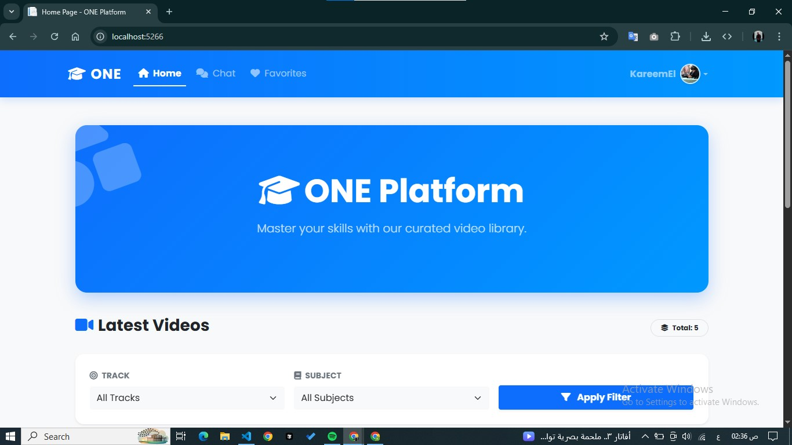
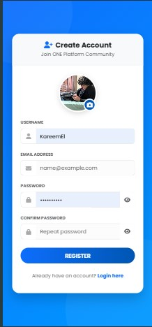
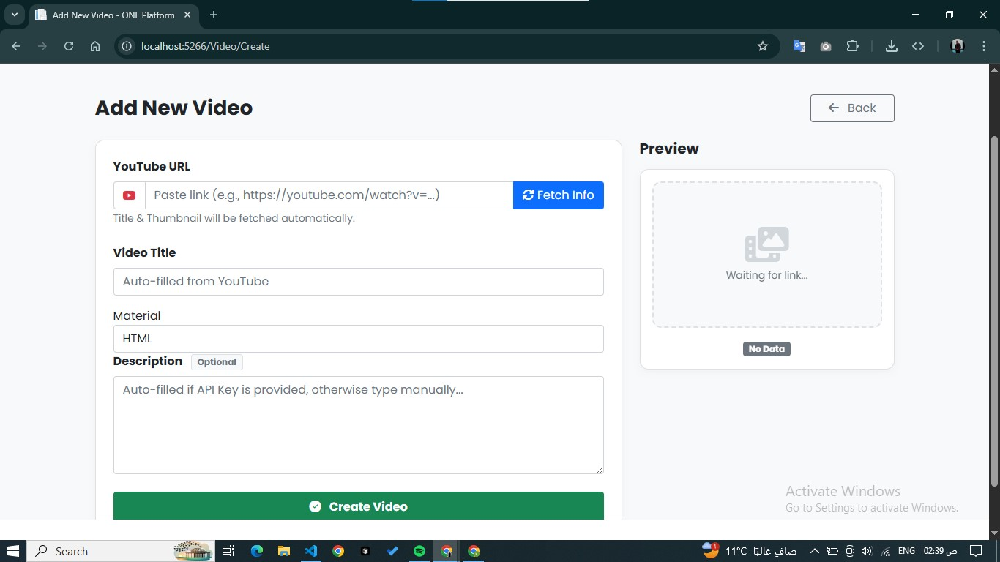

# 🎓 ONE Educational Platform


**ONE Platform** is a modern, full-stack educational web application built with **ASP.NET Core MVC**. It features a curated video library, a real-time AI study assistant powered by **Google Gemini**, and a comprehensive admin dashboard for content management.

## ✨ Key Features

### 🤖 AI Study Assistant (Chatbot)
- **Real-time Communication:** Built using **SignalR** for instant messaging without page reloads.
- **Smart Responses:** Integrated with **Google Gemini API** to answer student queries.
- **Chat History:** Automatically saves and retrieves chat history for logged-in users.

### 📹 Video Library
- **Smart Fetching:** Automatically extracts Video Title, Description, and Thumbnail from YouTube using just the URL.
- **Cinema Mode:** Custom video player modal with a distraction-free viewing experience.
- **Organization:** Categorized by Tracks and Subjects (Materials) with dynamic filtering.

### 🛡️ Authentication & Authorization
- **Secure System:** Built on **ASP.NET Core Identity**.
- **User Profiles:** Custom profile management with avatar uploads.
- **Role-Based Access:** Separate dashboards for Admins and Students.

### 🎨 Modern UI/UX
- **Responsive Design:** Fully responsive using **Bootstrap 5**.
- **Interactive:** Animations using **AOS (Animate On Scroll)** and **SweetAlert2** for notifications.
- **Glassmorphism:** Modern visual aesthetics with gradient backgrounds.

---

## 🛠️ Tech Stack

- **Framework:** ASP.NET Core MVC (.NET 8)
- **Database:** SQL Server / Entity Framework Core
- **Real-Time:** SignalR
- **AI Integration:** Google Gemini API
- **Video Integration:** YouTube Data API / NoEmbed
- **Frontend:** HTML5, CSS3, JavaScript, Bootstrap 5
- **Libraries:** SweetAlert2, AOS.js, FontAwesome

---

## 📸 Screenshots

| Home Page | Create Account | Add Video |
| :---: | :---: | :---: |
|  |  |  |

*(Note: Make sure the image filenames match exactly what is in your screenshots folder)*

---

## 🚀 Getting Started

### Prerequisites
- [.NET SDK](https://dotnet.microsoft.com/download) installed.
- SQL Server installed.
- A Google Gemini API Key (Get it from [Google AI Studio](https://aistudio.google.com/)).

### Installation

1.  **Clone the repository**
    ```bash
    git clone https://github.com/yourusername/ONE-Platform.git
    cd ONE-Platform
    ```

2.  **Configure Database & API Keys**
    Update `appsettings.json` with your connection string and API key:
    ```json
    {
      "ConnectionStrings": {
        "DefaultConnection": "Server=.;Database=OnePlatformDB;Trusted_Connection=True;TrustServerCertificate=True;"
      },
      "Gemini": {
        "ApiKey": "YOUR_GEMINI_API_KEY_HERE"
      }
    }
    ```

3.  **Run Migrations**
    Open Package Manager Console or Terminal and run:
    ```bash
    dotnet ef database update
    ```

4.  **Run the Application**
    ```bash
    dotnet run
    ```

---

## 🕹️ Usage

1.  **Register** a new account to access the platform.
2.  **Admin Access:** (You may need to seed an admin user or update the database role manually for the first user).
3.  **Add Tracks & Materials:** Go to the Admin Dashboard to set up the curriculum.
4.  **Add Videos:** Use the "Add Video" page, paste a YouTube link, and let the system fetch the details.
5.  **Chat:** Visit the Chat page to interact with the AI assistant.

---

## 🤝 Contributing

Contributions are welcome! Please follow these steps:
1.  Fork the project.
2.  Create your feature branch (`git checkout -b feature/AmazingFeature`).
3.  Commit your changes (`git commit -m 'Add some AmazingFeature'`).
4.  Push to the branch (`git push origin feature/AmazingFeature`).
5.  Open a Pull Request.

---

## 📄 License

This project is licensed under the MIT License - see the [LICENSE](LICENSE) file for details.

---

**Developed with ❤️ by Kareem Elawamy**